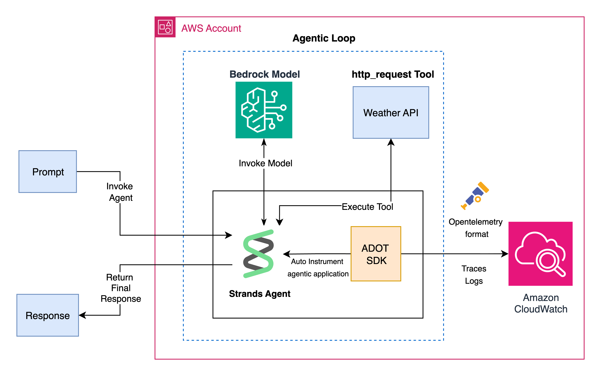

# Amazon CloudWatch generative AI observability samples

This repository demonstrates how to deploy generative AI applications with comprehensive [Amazon CloudWatch generative AI observability](https://docs.aws.amazon.com/AmazonCloudWatch/latest/monitoring/GenAI-observability.html) (Preview) across different supported generative AI hosts including [Amazon Bedrock AgentCore](https://aws.amazon.com/bedrock/agentcore/)(Preview), [Amazon Elastic Kubernetes Service (Amazon EKS)](https://aws.amazon.com/pm/eks/), [Amazon Elastic Container Service (Amazon ECS)](https://aws.amazon.com/pm/ecs) and [Amazon EC2](https://aws.amazon.com/pm/ec2/)

## Overview

The sample weather agent is a Python application that uses:

- **Strands Agent Framework** for AI-powered weather assistance
- **National Weather Service API** for weather data
- **Amazon Bedrock** for AI model inference
- **OpenTelemetry** for distributed tracing and observability
- **Amazon CloudWatch** for logs, traces and metrics

## Architecture



The architecture demonstrates how the telemetry from the weather agent is sent to Amazon CloudWatch by [AWS Distro for OpenTemetry (ADOT) python](https://pypi.org/project/aws-opentelemetry-distro/) auto-instrumentation SDK.

## Prerequisites

- An AWS account with AWS Identity and Access Management (IAM) permissions for Amazon Bedrock, Amazon CloudWatch, AWS X-Ray, and the specific compute service (EKS, ECS, EC2, or Bedrock AgentCore)
- [AWS CLI](https://aws.amazon.com/cli/) installed and configured
- Python 3.10 or later
- Container runtime (Docker 20.10+, Finch 1.0+, or Podman 4.0+) for containerized deployments
- Amazon [Bedrock model access](https://docs.aws.amazon.com/bedrock/latest/userguide/model-access-modify.html) enabled for **Claude Sonnet 4** in your AWS environment
- Enable [Transaction Search](https://docs.aws.amazon.com/AmazonCloudWatch/latest/monitoring/Enable-TransactionSearch.html) in the CloudWatch console

## Configuration

Before deploying any component, review and update the configuration values in the application files. All deployments use Claude Sonnet 4 by default, but you can modify the model and region if needed:

```python
# Update model_id and region_name if necessary before deployment
bedrock_model = BedrockModel(
    model_id="us.anthropic.claude-sonnet-4-20250514-v1:0",  # Change model_id if needed
    region_name="us-east-1"  # Change region_name if needed
)
```

**For Bedrock AgentCore deployment:** After deploying your agent, update the agent runtime ARN and region in `bedrock-agentcore-observability/invoke.py`:

After deployment, update the agent runtime ARN and region in `invoke.py`:

```python
# Update region if needed
agent_client = boto3.client(
    'bedrock-agentcore',
    region_name='us-east-1'  # Change if needed
)

# Replace with your actual agent runtime ARN after deployment
agentRuntimeArn="arn:aws:bedrock-agentcore:REGION:ACCOUNT_ID:runtime/AGENT_NAME",  # Update this ARN
```

## Project Structure

```text
amazon-cloudwatch-generative-ai-observability-samples/
├── bedrock-agentcore-observability/
│   ├── agent.py
│   ├── invoke.py
│   ├── requirements.txt
│   ├── __init__.py
│   └── README.md
├── eks-genAI-observability/
│   ├── docker/
│   │   ├── app/
│   │   │   ├── app.py
│   │   │   └── requirements.txt
│   │   └── Dockerfile
│   ├── chart/
│   │   ├── templates/
│   │   ├── values.yaml
│   │   └── Chart.yaml
│   └── README.md
├── ecs-genAI-observability/
│   ├── cloudformation/
│   │   └── weather-agent-ecs.yaml
│   ├── docker/
│   │   ├── app/
│   │   │   ├── app.py
│   │   │   └── requirements.txt
│   │   └── Dockerfile
│   └── README.md
├── ec2-genAI-observability/
│   ├── cloudformation/
│   │   └── weather-agent-ec2.yaml
│   ├── app/
│   │   ├── app.py
│   │   └── app-customspan.py
│   └── README.md
└── README.md
```

## Deployment Options

### 1. AWS Bedrock AgentCore Deployment

Deploy the weather agent using AWS Bedrock AgentCore for serverless AI agent hosting.

**Quick Start:**

```bash
cd bedrock-agentcore-observability
# Follow instructions in bedrock-agentcore-observability/README.md
```

**Key Components:**

- Python agent with Strands framework
- AWS Bedrock AgentCore runtime
- IAM role for execution permissions
- OpenTelemetry tracing integration
- CloudWatch observability

---

### 2. Amazon EKS Deployment

Deploy the weather agent as a containerized service in Amazon EKS with Helm charts.

**Quick Start:**

```bash
cd eks-genAI-observability
# Follow instructions in eks-genAI-observability/README.md
```

**Key Components:**

- Helm chart with configurable values
- Docker container with OpenTelemetry instrumentation
- EKS Pod Identity for secure AWS access with IAM role-based authentication
- CloudWatch integration for logs and traces

---

### 3. Amazon ECS Deployment

Deploy the weather agent as a Fargate service in Amazon ECS using CloudFormation.

**Quick Start:**

```bash
cd ecs-genAI-observability
# Follow instructions in ecs-genAI-observability/README.md
```

**Key Components:**

- Single CloudFormation template for complete infrastructure
- Fargate task definition with environment variables
- IAM roles with specific policies for Amazon Bedrock model access, Amazon CloudWatch logging, and AWS X-Ray tracing
- Session Manager and ECS Exec access

---

### 4. Amazon EC2 Deployment

Deploy the weather agent directly on an EC2 instance with automated setup.

**Quick Start:**

```bash
cd ec2-genAI-observability
# Follow instructions in ec2-genAI-observability/README.md
```

**Key Components:**

- CloudFormation template with EC2 instance and VPC
- Automated Python 3.12 and dependency installation
- IAM roles with specific policies for Amazon Bedrock, Amazon CloudWatch, and AWS X-Ray access
- AWS Systems Manager Session Manager for secure access with IAM-based authentication

---

## Observability Features

Amazon CloudWatch generative AI observability provides comprehensive monitoring for generative AI workloads, including Amazon Bedrock AgentCore agents. This enables you to gain insights into AI performance, health, and accuracy while reducing manual assessment overhead.

### Key Capabilities

- **End-to-End Prompt Tracing**: Quickly identify issues in components such as knowledge bases, tools, and models
- **AI Performance Monitoring**: Monitor model invocations, agents (managed, self-hosted, and third-party), knowledge bases, guardrails, and tools
- **Framework Compatibility**: Works with popular generative AI orchestration frameworks including AWS Strands, LangChain, and LangGraph
- **Production Readiness**: Progress from agent experimentation to production while ensuring superior quality, performance, and reliability

### Pre-Built Dashboards

Amazon CloudWatch provides two pre-configured dashboards for generative AI observability:

#### Model Invocations Dashboard

Detailed metrics on model usage, token consumption, and costs (requires Amazon Bedrock to be enabled)

#### Amazon Bedrock AgentCore Agents Dashboard

Performance and decision metrics for Amazon Bedrock agents

### Key Metrics

The dashboards include comprehensive metrics for monitoring your generative AI applications:

- **Invocation Metrics**: Total and average invocations across your AI workloads
- **Token Usage**: Total tokens, average per query, input tokens, and output tokens
- **Performance**: Latency metrics including average, P90, and P99 percentiles
- **Reliability**: Error rates and throttling events
- **Cost Attribution**: Track costs by application, user role, or specific user

### Integrated Observability Tools

Leverage existing Amazon CloudWatch observability capabilities:

- **Application Signals**: Monitor application performance and health
- **Alarms**: Set up proactive alerts for critical metrics
- **Dashboards**: Create custom views of your generative AI metrics
- **Sensitive Data Protection**: Protect sensitive information in logs and traces
- **Logs Insights**: Query and analyze log data for troubleshooting

### Trace Collection

- **Amazon Bedrock Integration**: Access prompt traces automatically when using Amazon Bedrock
- **Third-Party Models**: Send structured traces of third-party models to CloudWatch using AWS Distro for OpenTelemetry (ADOT) SDK
- **End-to-End Visibility**: Track requests across your entire generative AI application stack

## Getting Started

1. **Choose your deployment platform** based on your requirements
2. **Navigate to the appropriate directory** (bedrock-agentcore-observability, eks-genAI-observability, ecs-genAI-observability, or ec2-genAI-observability)
3. **Follow the platform-specific README** for detailed instructions
4. **Test the deployment** using the provided connection methods
5. **Monitor observability** through Amazon CloudWatch and AWS X-Ray

## Cleanup

Each deployment includes cleanup instructions to remove all created resources and avoid ongoing charges. Always run the cleanup commands when finished testing.

## Security

See [CONTRIBUTING](CONTRIBUTING.md#security-issue-notifications) for more information.

## License

This library is licensed under the MIT-0 License. See the [LICENSE](LICENSE) file.
